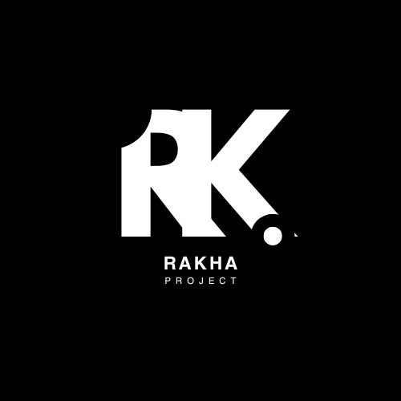

# WarkopKhaa - Website Pemesanan Makanan & Minuman

[](https://warkopkhaa.netlify.app/)



Website resmi WarkopKhaa untuk pemesanan makanan dan minuman secara online. Dibangun dengan React.js dan berbagai teknologi modern lainnya.

🌐 **Website Live:** [https://warkopkhaa.netlify.app/](https://warkopkhaa.netlify.app/)

## Fitur

- 📱 **Tampilan Responsif** - Dapat diakses dari berbagai perangkat
- 🍽️ **Menu Digital** - Lihat daftar menu lengkap dengan gambar
- 🛒 **Keranjang Belanja** - Tambah, kurangi, atau hapus pesanan
- 📍 **Pilihan Layanan** - Dine-in, Take Away, atau Delivery
- 📱 **WhatsApp Integration** - Langsung terhubung ke WhatsApp untuk konfirmasi pesanan
- 💳 **Pembayaran** - Informasi pembayaran yang lengkap

## Teknologi yang Digunakan

- ⚛️ React.js
- 🎨 Tailwind CSS
- 🔄 React Router
- 🛒 Context API (State Management)
- 🎭 React Icons
- 🚀 Webpack

## Persyaratan Sistem

- Node.js (v14.0.0 atau lebih baru)
- npm (v6.0.0 atau lebih baru) atau yarn
- Browser modern (Chrome, Firefox, Safari, Edge)

## Cara Menjalankan Proyek

### 1. Klon Repository

```bash
git clone [URL_REPOSITORY]
cd projectkha
```

### 2. Instal Dependensi

```bash
npm install
# atau
yarn install
```

### 3. Menjalankan Aplikasi

Untuk mode pengembangan (development):

```bash
npm start
# atau
yarn start
```

Aplikasi akan berjalan di [http://localhost:3000](http://localhost:3000) secara otomatis di browser default Anda.

### 4. Build untuk Produksi

Untuk membuat versi produksi yang sudah dioptimasi:

```bash
npm run build
# atau
yarn build
```

File-file produksi akan dibuat di direktori `build/`.

## Struktur Proyek

```
projectkha/
├── public/               # File-file statis
│   ├── images/           # Gambar-gambar website
│   └── index.html        # Template HTML
├── src/
│   ├── components/       # Komponen-komponen React
│   ├── contexts/         # Context API
│   ├── pages/            # Halaman-halaman website
│   ├── styles/           # File-file CSS/animasi
│   ├── App.jsx           # Komponen utama
│   └── index.js          # Entry point aplikasi
├── package.json
└── README.md
```

## Kontribusi

1. Fork repository ini
2. Buat branch fitur (`git checkout -b fitur/namafitur`)
3. Commit perubahan Anda (`git commit -m 'Menambahkan fitur baru'`)
4. Push ke branch (`git push origin fitur/namafitur`)
5. Buat Pull Request

## Kontak

- **Nama:** Muhammad Rakha Akbar
- **Posisi:** Pemilik WarkopKhaa
- **Kontak:** [Masukkan nomor/email kontak]

## Lisensi

Proyek ini dilisensikan di bawah [MIT License](LICENSE).

---

© 2025 WarkopKhaa. All rights reserved.